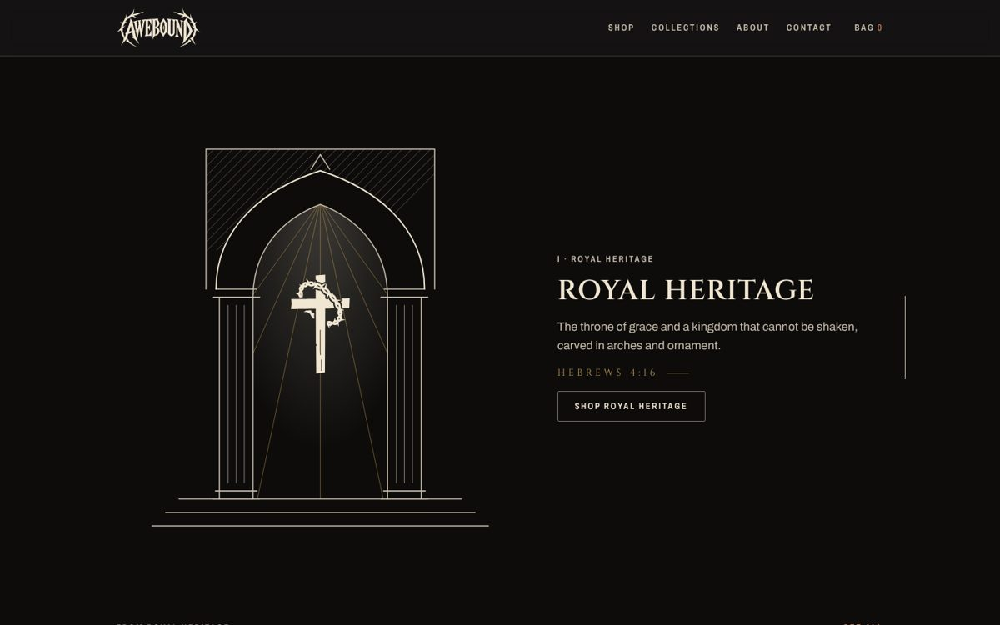

# Awebound

The website and store for **Awebound**, an independent Christian apparel brand for people who are not ashamed to express their faith. Every design tells a story about Jesus Christ and carries a full Scripture reference; the pillars are **Royal heritage. Freedom. Resurrection.**


## What's here

| Area                    | What it does                                                                                                                                                                                                                                                                                                                                                          |
| ----------------------- | --------------------------------------------------------------------------------------------------------------------------------------------------------------------------------------------------------------------------------------------------------------------------------------------------------------------------------------------------------------------- |
| **Home**                | A scroll journey. Light descends and reveals the Thorn Cross; then three pinned scenes drawn as engraved line art, one per pillar: an arch rises (Royal Heritage), a chain's center link opens (Broken Bond), the stone rolls away at dawn (Rolled Away). Each leads into that family's pieces. Visitors who prefer reduced motion get the finished frames, unpinned. |
| **Shop**                | Search (designs, verses, colors), category tabs, collection / color / size-in-stock / price filters with live counts, five sort orders, removable filter chips, "Show more". All state lives in the URL, so every view is shareable.                                                                                                                                  |
| **Product pages**       | Back print first, color and size pickers (sold-out sizes struck through), size guide, add to bag, the design story, Scripture reference and specs.                                                                                                                                                                                                                    |
| **Bag and checkout**    | A persisted bag drawer that re-prices against the API. Checkout hands the bag to Fourthwall's hosted checkout, which takes payment, prints and ships; the site holds no payment code.                                                                                                                                                                                 |
| **About, Contact, FAQ** | Brand story and pillars; a contact form that is stored and emailed to `contact@awebound.store`; answers to common questions.                                                                                                                                                                                                                                          |
| **Policies**            | Refund policy (made to order: misprints, damage and wrong items within 30 days), privacy policy and terms of service, drafted for review.                                                                                                                                                                                                                             |
| **Accounts**            | Passwordless only: Google, or a one-time email link or code. Guest checkout stays open to everyone.                                                                                                                                                                                                                                                                   |



## Stack

| Layer             | Choice                                                                                                                           |
| ----------------- | -------------------------------------------------------------------------------------------------------------------------------- |
| Monorepo          | pnpm workspaces, TypeScript 6 everywhere                                                                                         |
| Web               | Next.js 16 (App Router, Turbopack), React 19, Tailwind CSS 4 themed from brand tokens, Motion for animation, zustand for the bag |
| API               | Express 5, clean architecture (domain → application → infrastructure/interface), zod validation, pino logs                       |
| Commerce          | Fourthwall: live catalog (Storefront API), hosted checkout, payment and fulfillment                                              |
| Database and auth | Supabase: Postgres with row-level security (profiles, contact messages, sign-ups), Supabase Auth (Google OAuth + email OTP)      |
| Email             | Resend: transactional mail from the API, and SMTP for Supabase Auth emails                                                       |
| Brand             | `packages/brand`, a typed port of the `awebound-brand` skill (tokens, components, the wordmark and Thorn Cross as SVG)           |

```
awebound/
├─ apps/web          Next.js storefront
├─ apps/api          Express API
├─ packages/brand    tokens, CSS, React components, SVG marks
├─ packages/shared   zod contract, typed API client, catalog brand content
├─ packages/tsconfig shared compiler settings
├─ supabase          migrations, auth email templates, CLI config
└─ docs              ARCHITECTURE.md, DEPLOYMENT.md, TODOS.md
```

## Run it locally

Requirements: Node 22 and pnpm 10 (`corepack enable` picks up the pinned version).

```bash
pnpm install
cp apps/api/.env.example apps/api/.env       # then set FOURTHWALL_STOREFRONT_TOKEN
cp apps/web/.env.example apps/web/.env.local
pnpm dev
```

Every variable, with production values for awebound.store, is listed in the root [`.env.example`](.env.example).

Open http://localhost:3000. The API runs on http://localhost:4000 (`/health`).

The catalog and checkout always come from the Fourthwall shop, so the API needs `FOURTHWALL_STOREFRONT_TOKEN` (Fourthwall admin → Settings → For developers) to start. The shop lists the Fourthwall products that match the brand content in `packages/shared/src/content/catalog.json` by slug, and checkout hands off to Fourthwall's hosted checkout. Setup steps are in [docs/TODOS.md](docs/TODOS.md#fourthwall).

Without Supabase keys the API keeps contact messages and sign-ups in memory and accounts show "open soon"; without `RESEND_API_KEY` it prints emails to the terminal.

### With Supabase

```bash
supabase start          # local Postgres, Auth and Inbucket (needs Docker)
supabase db reset       # applies supabase/migrations
```

Then set in `apps/api/.env`: `SUPABASE_URL`, `SUPABASE_SECRET_KEY`; and in `apps/web/.env.local`: `NEXT_PUBLIC_SUPABASE_URL`, `NEXT_PUBLIC_SUPABASE_PUBLISHABLE_KEY`. Sign-in emails land in Inbucket at http://localhost:54324. Add `RESEND_API_KEY` to send real email.

## Scripts

| Command                           | What it does                                     |
| --------------------------------- | ------------------------------------------------ |
| `pnpm dev`                        | Web and API in watch mode                        |
| `pnpm build`                      | Production build of every package                |
| `pnpm start`                      | Run the built web and API                        |
| `pnpm typecheck`                  | Type-check every package                         |
| `pnpm lint`                       | ESLint everywhere (Next's rules for the web app) |
| `pnpm format`                     | Prettier                                         |
| `pnpm --filter @awebound/web art` | Regenerate the fallback product art              |

There are no automated tests in this repo, by design. Changes are verified with `typecheck`, `lint`, `build` and by running the flows in a browser.

## Deploy

Two Vercel projects from this repo: Root Directory `apps/web` and `apps/api`. Steps, variables and DNS: [docs/DEPLOYMENT.md](docs/DEPLOYMENT.md).

## Status

Built: every page, the shop and its filters, product pages, bag, contact, sign-up, sign-in screens.

Commerce: Fourthwall (live catalog and hosted checkout), always on. Waiting on accounts or content: the Awebound Fourthwall products, their prices and photography, the storefront token, a reset of the Supabase database, Google / Resend setup, deployment and a legal review of the policies. The full list is in [docs/TODOS.md](docs/TODOS.md).

## Docs

- [docs/ARCHITECTURE.md](docs/ARCHITECTURE.md): layers, data flow, auth and email, schema, and the Fourthwall integration
- [docs/DEPLOYMENT.md](docs/DEPLOYMENT.md): Vercel projects, environment variables, domains
- [docs/TODOS.md](docs/TODOS.md): decisions, setup steps and remaining work
- [AGENTS.md](AGENTS.md) and the `AGENTS.md` in each app and package: context and rules for coding agents
