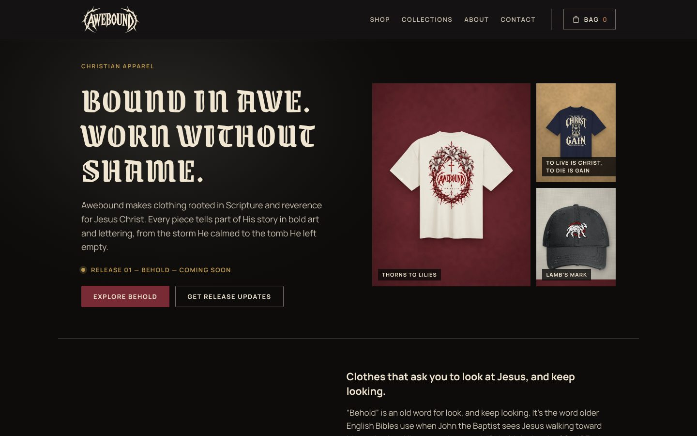
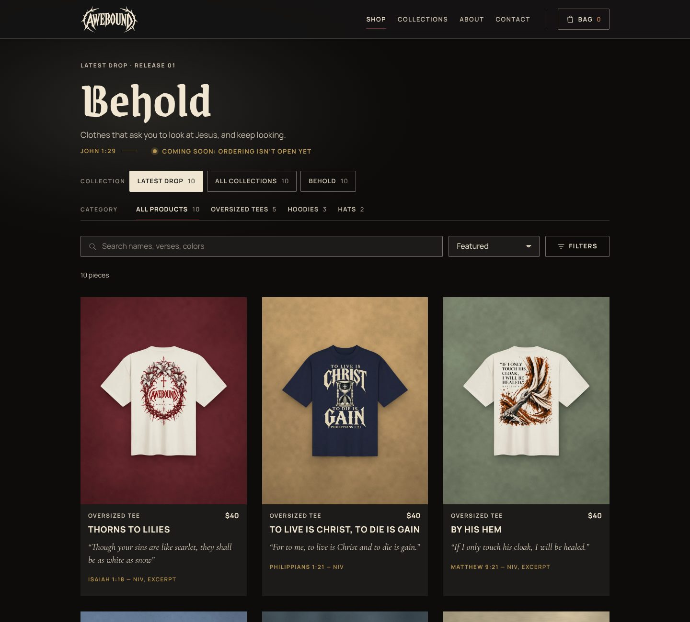

# Awebound

The website and store for **Awebound**, an independent Christian apparel brand for people who are not ashamed to express their faith. Awebound makes clothing rooted in Scripture and reverence for Jesus Christ; every design tells a story about Him and carries its full Scripture reference. Release 01 is **Behold**: five oversized tees, three hoodies and two caps, ten pieces that ask you to look at Jesus and keep looking.



## What's here

| Area                     | What it does                                                                                                                                                                                                                                                                                                                                                                                                                                                                               |
| ------------------------ | ------------------------------------------------------------------------------------------------------------------------------------------------------------------------------------------------------------------------------------------------------------------------------------------------------------------------------------------------------------------------------------------------------------------------------------------------------------------------------------------ |
| **Home**                 | The clothes first: a hero with three pieces beside the headline, the brand paragraph and the release status ("Release 01 — Behold — Coming Soon", Explore Behold, Get Release Updates). Then a short introduction to the latest release, all of its pieces, two design stories (the piece hanging in a stone niche in its own color, the verse and what the art does with it), a concise founder story and the release sign-up. Motion never hides words; reduced motion gets still pages. |
| **Shop and Collections** | A collection selector (Latest Drop, All Collections, then each release by name) and category tabs (All Products, Tees, Oversized Tees, Hats) that combine, with counts, search (names, verses, colors), a filter sheet (color, size, price), sort, chips and an empty state with a reset. State lives in the URL, so every view is shareable. `/collections` lists every release that exists; `/collections/<slug>` opens it in the shop.                                                  |
| **Product pages**        | The whole garment first; the name with its NIV verse; price, color and size with a size guide; Save to bag while the release is in preview (it says plainly that nothing is ordered) or Add to bag once it's live; delivery and returns in brief beside the button; the design story; product details; previous / next piece.                                                                                                                                                              |
| **Bag and checkout**     | A persisted bag drawer that re-prices on the server. Checkout hands the bag to Fourthwall's hosted checkout, which takes payment, prints and ships; the site holds no payment code. While a release is in preview the bag only saves selections and offers release updates.                                                                                                                                                                                                                |
| **About, Contact, FAQ**  | Why Awebound exists, what “bound in awe” means, how reverence shapes the work, and how every design is made; a contact form that is stored and emailed to `contact@awebound.store` (replies within 72 hours); answers to common questions.                                                                                                                                                                                                                                                 |
| **Policies**             | Refund policy (made to order: misprints, damage and wrong items within 30 days), privacy policy and terms of service, drafted for review.                                                                                                                                                                                                                                                                                                                                                  |
| **Accounts**             | Passwordless only: Google, or a one-time email link or code. Guest checkout stays open to everyone.                                                                                                                                                                                                                                                                                                                                                                                        |

Scripture on the website is quoted from the NIV through one shared record per piece (`SCRIPTURE_TRANSLATION=KJV` switches it back); the printed designs keep their approved lettering. Product images are Fourthwall's renders of each product (exactly what will be made), placed on each piece's own surface by `assets/mockups`. About carries Richard's portrait and a short note in his words; the footer ends with the wordmark.



## Stack

| Layer             | Choice                                                                                                                                  |
| ----------------- | --------------------------------------------------------------------------------------------------------------------------------------- |
| App               | One Next.js 16 app (App Router, Turbopack, Server Components and Server Actions), React 19, Tailwind CSS 4, Motion, zustand for the bag |
| Commerce          | Fourthwall: live catalog (Storefront API), hosted checkout, payment and fulfillment                                                     |
| Database and auth | Supabase: Postgres with row-level security (profiles, contact messages, sign-ups), Supabase Auth (Google OAuth + email OTP)             |
| Email             | Resend: transactional mail from the server, and SMTP for Supabase Auth emails                                                           |
| Brand             | `packages/brand` (tokens, components, the wordmark and Thorn Cross as SVG); rules in `docs/BRAND.md` and the `awebound-brand` skill     |

```
awebound/
├─ apps/web          the site: pages, server code (src/server), schemas (src/shared)
├─ packages/brand    tokens, CSS, React components, SVG marks
├─ packages/tsconfig shared compiler settings
├─ supabase          migrations, auth email templates, CLI config
└─ docs              ARCHITECTURE.md, DEPLOYMENT.md, TODOS.md
```

## Run it locally

Requirements: Node 22 and pnpm 10 (`corepack enable` picks up the pinned version).

```bash
pnpm install
cp apps/web/.env.example apps/web/.env.local   # then fill in the values
pnpm dev
```

Open http://localhost:3000. `apps/web/.env.example` lists every variable with a comment.

The catalog and checkout come from the Fourthwall shop when `FOURTHWALL_STOREFRONT_TOKEN` is set (Fourthwall admin → Settings → For developers). Pieces in the content file that aren't in Fourthwall yet, or all of them without a token, show as previews with the site's prices and mockups, and checkout says it opens soon.

Without Supabase keys accounts show "open soon" and contact messages and sign-ups aren't stored; without `RESEND_API_KEY` emails print to the terminal in development.

### With a local Supabase

```bash
supabase start          # local Postgres, Auth and a mail catcher (needs Docker)
supabase db reset       # applies supabase/migrations
```

Then point `NEXT_PUBLIC_SUPABASE_URL`, `NEXT_PUBLIC_SUPABASE_PUBLISHABLE_KEY` and `SUPABASE_SECRET_KEY` in `apps/web/.env.local` at it. Sign-in emails land in the local mail catcher at http://localhost:54324.

## Scripts

| Command          | What it does                                     |
| ---------------- | ------------------------------------------------ |
| `pnpm dev`       | The site in watch mode                           |
| `pnpm build`     | Production build of every package                |
| `pnpm start`     | Run the built site                               |
| `pnpm typecheck` | Type-check every package                         |
| `pnpm lint`      | ESLint everywhere (Next's rules for the web app) |
| `pnpm format`    | Prettier                                         |

There are no automated tests in this repo, by design. Changes are verified with `typecheck`, `lint`, `build` and by running the flows in a browser.

## Deploy

One Vercel project with Root Directory `apps/web`. Steps, variables and DNS: [docs/DEPLOYMENT.md](docs/DEPLOYMENT.md).

## Status

Built: every page, the shop and its filters, product pages, bag, contact, sign-up, sign-in screens.

Commerce: Fourthwall (live catalog and hosted checkout), always on. Next steps are at the top of [docs/TODOS.md](docs/TODOS.md): Vercel variables, retiring the old API project, resetting the Supabase database, and publishing the products in Fourthwall. Still waiting on prices and photography, Google / Resend setup and a legal review of the policies.

## Docs

- [docs/ARCHITECTURE.md](docs/ARCHITECTURE.md): how the app is put together, data flow, auth and email, schema, and the Fourthwall integration
- [docs/DEPLOYMENT.md](docs/DEPLOYMENT.md): the Vercel project, environment variables, domains
- [docs/TODOS.md](docs/TODOS.md): decisions, setup steps and remaining work
- [AGENTS.md](AGENTS.md) and the `AGENTS.md` in each app and package: context and rules for coding agents
