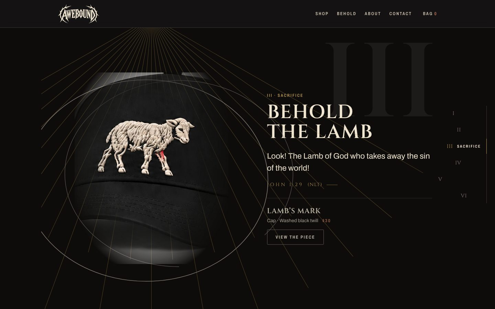

# Awebound

The website and store for **Awebound**, an independent Christian apparel brand for people who are not ashamed to express their faith. Every design tells a story about Jesus Christ and carries a full Scripture reference. The first release is **Behold**: five tees and a cap, a call to see Christ’s power, holiness, sacrifice, and resurrection.


## What's here

| Area                    | What it does                                                                                                                                                                                                                                                                                                                                                                                                                                                                                                                                                  |
| ----------------------- | ------------------------------------------------------------------------------------------------------------------------------------------------------------------------------------------------------------------------------------------------------------------------------------------------------------------------------------------------------------------------------------------------------------------------------------------------------------------------------------------------------------------------------------------------------------- |
| **Home**                | A scroll journey. Light descends on the Thorn Cross; a dark curtain tears from top to bottom to reveal BEHOLD; then six pinned scenes, one per piece (I Holiness to VI Sacrifice, ending on the Lamb). In each, the art is lit from above, engraved line art draws around it (rings of holy ground, a sea that goes still, a stone that rolls away) and the KJV verse lights word by word, with a I–VI rail to jump between them. Then the release grid and “Worn to be asked”, where a seed grows into wheat. Reduced motion gets finished frames, unpinned. |
| **Shop**                | The release as a numbered index (I–VI), search (designs, verses, colors), category tabs, a filter sheet (color, size in stock, price), five sort orders and removable chips. All state lives in the URL, so every view is shareable.                                                                                                                                                                                                                                                                                                                          |
| **Product pages**       | Back or front print first, color and size pickers (sold-out sizes struck through), size guide, add to bag, the KJV verse, specs and previous / next piece in the release.                                                                                                                                                                                                                                                                                                                                                                                     |
| **Bag and checkout**    | A persisted bag drawer that re-prices on the server. Checkout hands the bag to Fourthwall's hosted checkout, which takes payment, prints and ships; the site holds no payment code.                                                                                                                                                                                                                                                                                                                                                                           |
| **About, Contact, FAQ** | Brand story and how every design tells its story; a contact form that is stored and emailed to `contact@awebound.store` (replies within 72 hours); answers to common questions.                                                                                                                                                                                                                                                                                                                                                                               |
| **Policies**            | Refund policy (made to order: misprints, damage and wrong items within 30 days), privacy policy and terms of service, drafted for review.                                                                                                                                                                                                                                                                                                                                                                                                                     |
| **Accounts**            | Passwordless only: Google, or a one-time email link or code. Guest checkout stays open to everyone.                                                                                                                                                                                                                                                                                                                                                                                                                                                           |



## Stack

| Layer             | Choice                                                                                                                                  |
| ----------------- | --------------------------------------------------------------------------------------------------------------------------------------- |
| App               | One Next.js 16 app (App Router, Turbopack, Server Components and Server Actions), React 19, Tailwind CSS 4, Motion, zustand for the bag |
| Commerce          | Fourthwall: live catalog (Storefront API), hosted checkout, payment and fulfillment                                                     |
| Database and auth | Supabase: Postgres with row-level security (profiles, contact messages, sign-ups), Supabase Auth (Google OAuth + email OTP)             |
| Email             | Resend: transactional mail from the server, and SMTP for Supabase Auth emails                                                           |
| Brand             | `packages/brand`, a typed port of the `awebound-brand` skill (tokens, components, the wordmark and Thorn Cross as SVG)                  |

```
awebound/
├─ apps/web          the site: pages, server code (src/server), schemas (src/shared)
├─ packages/brand    tokens, CSS, React components, SVG marks
├─ packages/tsconfig shared compiler settings
├─ supabase          migrations, auth email templates, CLI config
└─ docs              ARCHITECTURE.md, DEPLOYMENT.md, TODOS.md
```

## Run it locally

Requirements: Node 22 and pnpm 10 (`corepack enable` picks up the pinned version).

```bash
pnpm install
cp apps/web/.env.example apps/web/.env.local   # then fill in the values
pnpm dev
```

Open http://localhost:3000. `apps/web/.env.example` lists every variable with a comment.

The catalog and checkout come from the Fourthwall shop when `FOURTHWALL_STOREFRONT_TOKEN` is set (Fourthwall admin → Settings → For developers). Pieces in the content file that aren't in Fourthwall yet, or all of them without a token, show as previews with the site's prices and mockups, and checkout says it opens soon.

Without Supabase keys accounts show "open soon" and contact messages and sign-ups aren't stored; without `RESEND_API_KEY` emails print to the terminal in development.

### With a local Supabase

```bash
supabase start          # local Postgres, Auth and a mail catcher (needs Docker)
supabase db reset       # applies supabase/migrations
```

Then point `NEXT_PUBLIC_SUPABASE_URL`, `NEXT_PUBLIC_SUPABASE_PUBLISHABLE_KEY` and `SUPABASE_SECRET_KEY` in `apps/web/.env.local` at it. Sign-in emails land in the local mail catcher at http://localhost:54324.

## Scripts

| Command          | What it does                                     |
| ---------------- | ------------------------------------------------ |
| `pnpm dev`       | The site in watch mode                           |
| `pnpm build`     | Production build of every package                |
| `pnpm start`     | Run the built site                               |
| `pnpm typecheck` | Type-check every package                         |
| `pnpm lint`      | ESLint everywhere (Next's rules for the web app) |
| `pnpm format`    | Prettier                                         |

There are no automated tests in this repo, by design. Changes are verified with `typecheck`, `lint`, `build` and by running the flows in a browser.

## Deploy

One Vercel project with Root Directory `apps/web`. Steps, variables and DNS: [docs/DEPLOYMENT.md](docs/DEPLOYMENT.md).

## Status

Built: every page, the shop and its filters, product pages, bag, contact, sign-up, sign-in screens.

Commerce: Fourthwall (live catalog and hosted checkout), always on. Next steps are at the top of [docs/TODOS.md](docs/TODOS.md): Vercel variables, retiring the old API project, resetting the Supabase database, and publishing the products in Fourthwall. Still waiting on prices and photography, Google / Resend setup and a legal review of the policies.

## Docs

- [docs/ARCHITECTURE.md](docs/ARCHITECTURE.md): how the app is put together, data flow, auth and email, schema, and the Fourthwall integration
- [docs/DEPLOYMENT.md](docs/DEPLOYMENT.md): the Vercel project, environment variables, domains
- [docs/TODOS.md](docs/TODOS.md): decisions, setup steps and remaining work
- [AGENTS.md](AGENTS.md) and the `AGENTS.md` in each app and package: context and rules for coding agents
