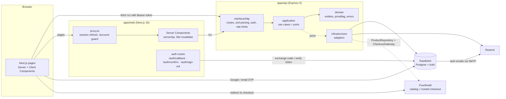
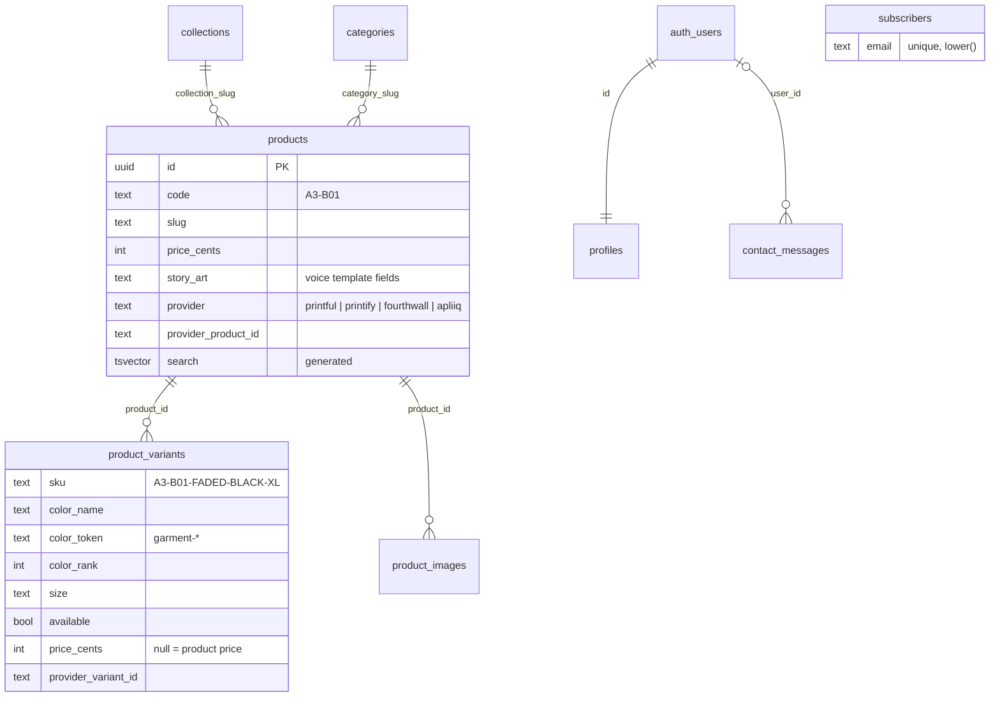
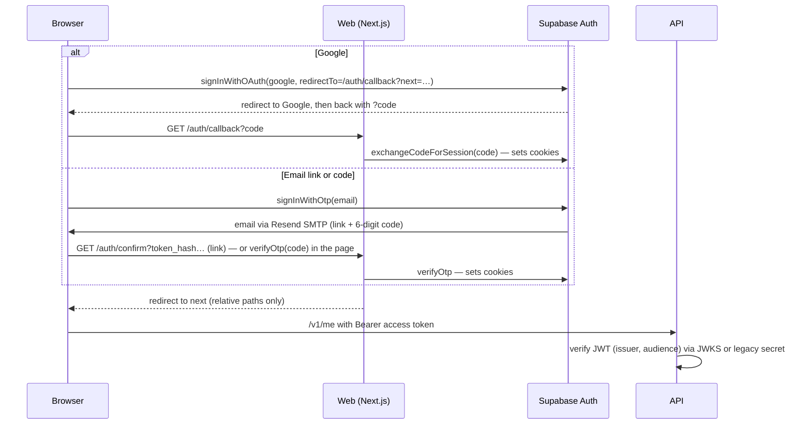

# Architecture

How the Awebound site is put together, why, and where to change things. Written for the owner and for coding agents; keep it current when structure changes.

## System overview



- The **web app** renders pages. Server Components read the catalog through the API; Client Components handle search, filters, the bag and forms.
- The **API** owns business rules: pricing the bag, search semantics, what happens at checkout, sending email, profile access.
- **Supabase** stores data and runs authentication. The browser talks to Supabase Auth directly to sign in; everything else goes through the API.
- **Fourthwall** (when `CATALOG_SOURCE` / `COMMERCE_PROVIDER` are `fourthwall`) supplies live products and stock, and runs checkout, payment and fulfillment.
- **Resend** delivers all email: auth emails (via Supabase's SMTP setting) and the API's transactional mail.

## Monorepo and dependencies

| Package             | Depends on    | Notes                                                                              |
| ------------------- | ------------- | ---------------------------------------------------------------------------------- |
| `packages/tsconfig` | –             | Base, library, Node and Next.js compiler settings                                  |
| `packages/shared`   | zod           | The contract: schemas, DTO types, `createApiClient`, `formatPrice`, sample catalog |
| `packages/brand`    | react (peer)  | Tokens, component CSS, Tailwind theme, typed components, SVG marks                 |
| `apps/api`          | shared        | Bundled with tsup; `@awebound/*` source is inlined into `dist/main.js`             |
| `apps/web`          | shared, brand | Next compiles the packages via `transpilePackages`                                 |

Internal packages ship TypeScript source, not build output. There is no package build step to forget.

## The API: clean architecture

```
domain/            ← no imports from other layers or frameworks
application/       ← use cases; depend on domain and on ports (interfaces) only
infrastructure/    ← adapters that implement ports (Supabase, Resend, in-memory, JWT)
interface/http/    ← Express: parse with shared zod schemas, call one use case, map errors
container.ts       ← composition root: picks adapters from env
main.ts            ← loads .env, builds container and app, listens
```

**Ports** (`application/ports`): `ProductRepository`, `CheckoutGateway`, `FulfillmentGateway`, `Mailer`, `ContactRepository`, `SubscriberRepository`, `ProfileRepository`, `TokenVerifier`, `Logger`.

**Adapters chosen by `container.ts`:**

| Port                              | With Supabase / keys                                                         | Without (local default)                          |
| --------------------------------- | ---------------------------------------------------------------------------- | ------------------------------------------------ |
| ProductRepository                 | `SupabaseProductRepository` (SQL search RPCs) when `CATALOG_SOURCE=supabase` | `InMemoryProductRepository` over the shared seed |
| Contact / Subscriber repositories | Supabase tables                                                              | in-memory                                        |
| ProfileRepository                 | Supabase `profiles`                                                          | unavailable (503)                                |
| TokenVerifier                     | `SupabaseTokenVerifier` (JWKS, or legacy HS256 secret)                       | disabled (503)                                   |
| Mailer                            | `ResendMailer`                                                               | `ConsoleMailer`                                  |
| CheckoutGateway                   | –                                                                            | `UnconfiguredCheckoutGateway` (always)           |

**Errors**: use cases throw `ValidationError`, `NotFoundError`, `UnauthorizedError`, `ForbiddenError` or `UnavailableError`. The error handler maps them to HTTP status codes and the shared body `{ error: { code, message, fields? } }`.

### Endpoints (`/v1`)

| Method and path        | Use case                  | Notes                                                                                                                                          |
| ---------------------- | ------------------------- | ---------------------------------------------------------------------------------------------------------------------------------------------- |
| `GET /products`        | SearchProducts            | `q, category, collection, color, size, minPrice, maxPrice, sort, page, pageSize`; lists accept comma-separated or repeated values. Cached 60s. |
| `GET /products/facets` | GetCatalogFacets          | Counts per category, collection, color, size; each facet ignores its own filter                                                                |
| `GET /products/:slug`  | GetProductBySlug          | Full product with variants and images                                                                                                          |
| `GET /collections`     | ListCollections           |                                                                                                                                                |
| `POST /bag/validate`   | ValidateBag               | Re-prices lines from the catalog, merges duplicates, caps quantity at 10, flags sold-out and missing items                                     |
| `POST /checkout`       | StartCheckout             | Guest allowed; links the user when a token is sent. Returns `redirect` or `unavailable`                                                        |
| `POST /contact`        | SubmitContactMessage      | Stores, emails the inbox (reply-to sender), acknowledges. Honeypot field `website`. 5 per 10 min per IP                                        |
| `POST /subscribers`    | SubscribeToDropNotes      | Idempotent; never reveals whether an address was already subscribed                                                                            |
| `GET /me`, `PATCH /me` | GetProfile, UpdateProfile | Bearer token required                                                                                                                          |
| `GET /health`          | –                         | Liveness                                                                                                                                       |

## Data model (Supabase)



- **Row-level security** is on for every table. Anyone may read published catalog rows. Profiles are readable and writable only by their owner. `contact_messages` and `subscribers` have no policies at all, so only the API's secret key can touch them.
- **Search runs in Postgres**: `search_products(...)` (filter, full-text rank, sort, page, total count) and `catalog_facets(...)` (jsonb counts). `InMemoryProductRepository` mirrors their semantics for offline development; change both together.
- **Seed**: `packages/shared/src/seed/catalog.json` is the single source for sample products. `pnpm db:seed` writes `supabase/seed.sql` from it; the offline API reads the same file. SKUs are identical in both, so a bag survives switching sources.
- **Profiles** are created by the `on_auth_user_created` trigger (name and avatar from Google when present).

## Auth



- Sessions live in cookies managed by `@supabase/ssr`. `src/proxy.ts` (Next 16's renamed middleware) refreshes them on each request and redirects signed-out visitors away from `/account`.
- The API never trusts a user id from the body; it reads the verified token's `sub`.
- Without `NEXT_PUBLIC_SUPABASE_*` the site shows "Accounts open soon" and keeps guest checkout.

## Email

| Email                                                              | Sent by                           | Template                                         |
| ------------------------------------------------------------------ | --------------------------------- | ------------------------------------------------ |
| Sign-in link and code, confirm email                               | Supabase Auth through Resend SMTP | `supabase/templates/*.html`                      |
| Contact notification to `contact@awebound.store` (reply-to sender) | API → Resend                      | `apps/api/src/infrastructure/email/templates.ts` |
| Contact acknowledgement                                            | API → Resend                      | same                                             |
| Drop-notes welcome                                                 | API → Resend                      | same                                             |

Templates use the signature lockup (oxblood wordmark on warm bone) as a hosted PNG and inline hex colors, because email clients ignore CSS variables and strip SVG.

## Bag and checkout

1. The bag lives in the browser (zustand, persisted to localStorage, keyed by SKU).
2. Whenever the bag is shown, `POST /v1/bag/validate` re-prices it. The client's prices are display copies only.
3. **Check out** calls `POST /v1/checkout`. `StartCheckout` prices the bag again and hands the available lines to the `CheckoutGateway`.
4. `COMMERCE_PROVIDER` picks the gateway. `none` → `UnconfiguredCheckoutGateway`: the drawer shows "Checkout opens soon" and offers a notify sign-up. `fourthwall` → `FourthwallCheckoutGateway`: the API creates a Fourthwall cart and the browser is sent to Fourthwall's hosted checkout.

### Fourthwall (chosen provider)

Fourthwall takes payment, prints and ships, and sends order emails, so the site needs no payment code and no orders table. Two adapters, both in `apps/api/src/infrastructure/`:

- **Catalog** (`CATALOG_SOURCE=fourthwall`, `fourthwall/fourthwall-product-repository.ts`). Loads every product from the Storefront API (`GET /collections/all/products`) and merges it with the brand content in `packages/shared/src/seed/catalog.json` (`fourthwall/merge-catalog.ts`):
  - Fourthwall is the truth for what can be bought: variants, prices, stock and photos.
  - The content file is the truth for the story: product ID, collection, cut, Scripture, copy.
  - They match by slug: the Fourthwall product's URL slug equals the content `slug`, or the content entry sets `fourthwallSlug`. A product shows on the site only when both sides exist; the API logs the ones that don't match.
  - Site SKUs are Fourthwall variant ids. Color names that match a brand garment color (`colors` in the content file) use the brand swatch; others use Fourthwall's swatch hex (`Color.swatch`, rendered with `colorCss`).
  - Search, filters and facets run on the merged set with the in-memory engine. The merged catalog is cached for 60 seconds; if Fourthwall is unreachable the last good copy keeps serving.
- **Checkout** (`COMMERCE_PROVIDER=fourthwall`, `commerce/fourthwall-checkout-gateway.ts`). `POST /carts` with the bag's variant ids and quantities, then `{ status: "redirect", url: "https://<FOURTHWALL_CHECKOUT_DOMAIN>/checkout/?cartCurrency=USD&cartId=…" }`. Sold-out errors from Fourthwall come back as a 400 asking the shopper to refresh the bag.

The storefront token is used only by the API. The Supabase catalog (`CATALOG_SOURCE=supabase`) can also drive Fourthwall checkout if `product_variants.provider_variant_id` holds the Fourthwall variant ids.

### Plugging in a commerce provider

| Provider                       | What the adapter does                                                                                                                                                                                                                                       |
| ------------------------------ | ----------------------------------------------------------------------------------------------------------------------------------------------------------------------------------------------------------------------------------------------------------- |
| **Fourthwall** (built)         | Create a cart with the Storefront API from the bag lines; return `{ status: "redirect", url }` to Fourthwall's hosted checkout. Fourthwall takes payment and fulfills.                                                                                      |
| **Printful, Printify, Apliiq** | These print and ship only. The adapter first sends the shopper to a payment provider's hosted checkout; a payment webhook then creates the order through a `FulfillmentGateway` adapter using `provider_variant_id`. Needs `orders` / `order_items` tables. |

Steps: implement the port in `apps/api/src/infrastructure/commerce/`, add its env vars to `env.ts` and `.env.example`, select it in `createCheckoutGateway` (`container.ts`) from `COMMERCE_PROVIDER`, and sync provider ids into `products` / `product_variants`. See `docs/TODOS.md`.

## Frontend

- **Rendering**: catalog pages are server-rendered from the API with 60-second revalidation; `withFallback` renders an empty state if the API is down instead of failing the page.
- **Shop state** is the URL. `CatalogStateProvider` reads search params, updates them optimistically (`useOptimistic`) and replaces the URL in a transition, so controls respond instantly while results stream in.
- **Styling** in three layers: `tokens.css` (variables, both themes) → brand component classes (`.aw-*`, `@layer components`) → Tailwind utilities for layout with a theme limited to brand colors. Fonts (Cinzel, Archivo) are self-hosted via `next/font/local`.
- **Motion**: `motion/react`. Standard entrances are 300ms fades with a 12px rise (`<Reveal>`). The home journey is the one deliberate exception: three 260vh sections whose sticky panels map scroll progress to SVG path drawing and transforms. `prefers-reduced-motion` turns pinning off in CSS and shows each scene finished.
- **Overlays** use the native `<dialog>` element (`components/sheet.tsx`): focus trapping, Escape and an inert page come from the browser.
- **SEO**: per-page metadata and canonicals, Open Graph image, `sitemap.xml`, `robots.txt`, JSON-LD for products and the FAQ.

## Security

- Secret keys (`SUPABASE_SECRET_KEY`, `RESEND_API_KEY`) exist only in the API's environment. The browser gets the Supabase publishable key and the API URL.
- CORS allows only `WEB_ORIGIN`. JSON bodies are capped at 32 KB. Helmet sets API headers; Next sets `nosniff`, `Referrer-Policy`, `X-Frame-Options` and `Permissions-Policy`.
- Rate limits per IP on bag validation, checkout, contact and subscribe. Set `TRUST_PROXY=1` behind a proxy so limits see the real client address. Multiple API instances need a shared store (see TODOS).
- Logs redact email addresses and authorization headers.
- Sign-in redirects accept relative paths only (`safeNext`). Sign-out is POST-only.

## Environment variables

| Variable                                                           | Where | Purpose                                                        |
| ------------------------------------------------------------------ | ----- | -------------------------------------------------------------- |
| `PORT`, `NODE_ENV`, `LOG_LEVEL`                                    | API   | Server basics                                                  |
| `WEB_ORIGIN`                                                       | API   | CORS allow-list (comma-separated, `*` = one DNS label)         |
| `PUBLIC_SITE_URL`                                                  | API   | Links and images in email                                      |
| `TRUST_PROXY`                                                      | API   | `1` behind a load balancer                                     |
| `CATALOG_SOURCE`                                                   | API   | `seed` (default), `supabase` or `fourthwall`                   |
| `SUPABASE_URL`, `SUPABASE_SECRET_KEY`                              | API   | Database and admin access                                      |
| `SUPABASE_JWT_SECRET`                                              | API   | Only for projects on the legacy HS256 secret                   |
| `RESEND_API_KEY`, `EMAIL_FROM`, `CONTACT_INBOX`                    | API   | Email (required in production)                                 |
| `COMMERCE_PROVIDER`                                                | API   | `none` (default) or `fourthwall`                               |
| `FOURTHWALL_STOREFRONT_TOKEN`, `FOURTHWALL_CHECKOUT_DOMAIN`        | API   | Fourthwall catalog and hosted checkout                         |
| `FOURTHWALL_CURRENCY`, `FOURTHWALL_API_URL`                        | API   | Defaults `USD` and the public Storefront API                   |
| `NEXT_PUBLIC_SITE_URL`                                             | Web   | Metadata, sitemap, auth redirects                              |
| `NEXT_PUBLIC_API_URL`, `API_URL`                                   | Web   | API for the browser; optional private URL for server rendering |
| `NEXT_PUBLIC_SUPABASE_URL`, `NEXT_PUBLIC_SUPABASE_PUBLISHABLE_KEY` | Web   | Sign-in                                                        |

## Deployment

Two Vercel projects from this repo: Root Directory `apps/web` (Next.js) and `apps/api` (Express as a single Vercel Function via the Build Output API: `pnpm build:vercel` → `apps/api/.vercel/output`, entry `src/vercel.ts`). Each app's `vercel.json` sets a filtered pnpm install and its build. Step-by-step setup, variables and DNS: [DEPLOYMENT.md](DEPLOYMENT.md).

The API also runs as a plain Node server anywhere else: `pnpm --filter @awebound/api build`, `node apps/api/dist/main.js`, health check `/health`. Supabase: `supabase link`, then `supabase db push`.
