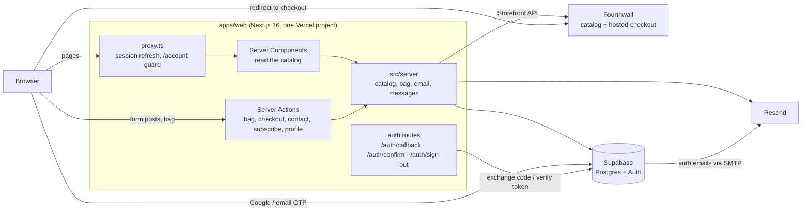
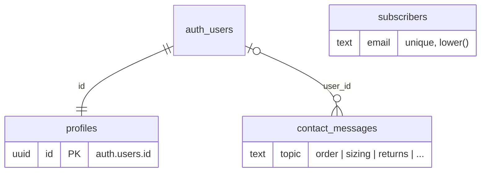
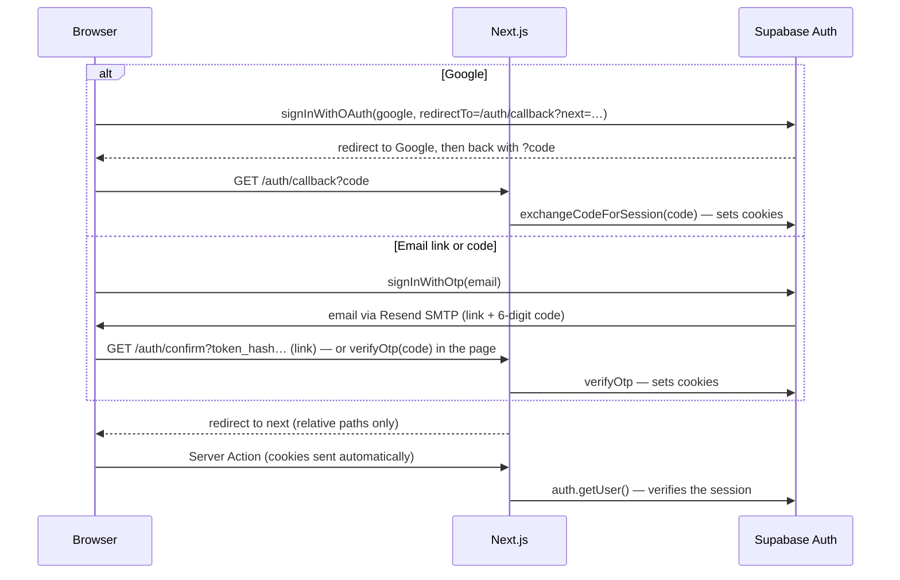

# Architecture

How the Awebound site is put together, why, and where to change things. Written for the owner and for coding agents; keep it current when structure changes.

## System overview

- **One Next.js app** does everything. Server Components read the catalog directly from server code. The browser reaches the server only through Server Actions. There is no separate API.
- **Fourthwall** supplies live products, prices, stock and photos, and runs checkout, payment and fulfillment.
- **Supabase** runs authentication and stores profiles, contact messages and drop-note sign-ups.
- **Resend** delivers all email: auth emails (via Supabase's SMTP setting) and the site's transactional mail.

## Workspace

| Package             | Depends on   | Notes                                                              |
| ------------------- | ------------ | ------------------------------------------------------------------ |
| `packages/tsconfig` | –            | Base, library and Next.js compiler settings                        |
| `packages/brand`    | react (peer) | Tokens, component CSS, Tailwind theme, typed components, SVG marks |
| `apps/web`          | brand        | The site. Next compiles `packages/brand` via `transpilePackages`   |

## Server code (`apps/web/src/server`)

Plain modules, one per job. Everything here is server-only; Client Components import only `actions.ts`.

| File                 | Does                                                                                                                       |
| -------------------- | -------------------------------------------------------------------------------------------------------------------------- |
| `actions.ts`         | The Server Actions (below). Parse input with `src/shared` schemas, read the user from the session, return `Result<T>`.     |
| `catalog.ts`         | `getCatalog()` (Fourthwall + brand content, once per request), `searchProducts`, `getFacets`, `getProduct`, `withFallback` |
| `catalog-merge.ts`   | Merges Fourthwall products with the brand content by slug                                                                  |
| `catalog-search.ts`  | Search, filters, facets (each ignores its own filter) and sorting over the merged catalog                                  |
| `fourthwall.ts`      | Storefront API client: product list (cached 60 s by Next's data cache), cart creation                                      |
| `bag.ts`             | Re-prices a bag from the catalog; creates the Fourthwall cart and checkout URL                                             |
| `messages.ts`        | Contact messages and drop-note sign-ups: store in Supabase, email through Resend                                           |
| `email.ts`           | `sendEmail()`: Resend, or the terminal in development; fails in production without a key                                   |
| `email-templates.ts` | The transactional email templates                                                                                          |
| `errors.ts`          | `UserError` (a message safe to show), `Result<T>`, `run()`, `parse()`                                                      |
| `env.ts`             | Server-only env (zod)                                                                                                      |
| `content/`           | `catalog.json`: the brand story per product                                                                                |

`src/shared` holds the zod schemas, types and helpers (`formatPrice`, `colorCss`) used on both sides. `src/lib/supabase` has the browser, server (cookie session) and admin (secret key) clients.

### Server Actions

| Action             | Input               | Notes                                                                                                                 |
| ------------------ | ------------------- | --------------------------------------------------------------------------------------------------------------------- |
| `validateBag`      | `{ lines }`         | Re-prices lines from the catalog, merges duplicates, caps quantity at 10, flags sold-out and missing items            |
| `startCheckout`    | `{ lines }`         | Creates a Fourthwall cart from the available lines; returns `{ url }`. Links the signed-in user. 30 per 10 min per IP |
| `loadMoreProducts` | shop query + `page` | "Show more" in the shop grid                                                                                          |
| `sendContact`      | contact form        | Stores, emails the inbox (reply-to sender), acknowledges. Honeypot field `website`. 5 per 10 min per IP               |
| `subscribe`        | `{ email, source }` | Never reveals whether an address was already subscribed. 10 per 10 min per IP                                         |
| `updateProfile`    | `{ fullName }`      | Signed-in users only                                                                                                  |

Every action returns `{ ok: true, data }` or `{ ok: false, error, fields? }`. Next hides thrown error messages in production, so messages meant for the shopper are thrown as `UserError` and come back as values; anything else is logged and becomes a generic message.

## Data model (Supabase)

- The catalog is not in Postgres: Fourthwall supplies it (see "Fourthwall" below).
- **Row-level security** is on for every table. Profiles are readable and writable only by their owner (the account page reads with the user's session). `contact_messages` and `subscribers` have no policies at all, so only the server's secret key can touch them.
- **Profiles** are created by the `on_auth_user_created` trigger (name and avatar from Google when present). `updateProfile` upserts, so a user without a row still works.

## Auth

- Sessions live in cookies managed by `@supabase/ssr`. `src/proxy.ts` (Next 16's renamed middleware) refreshes them on each request and redirects signed-out visitors away from `/account`.
- Server code never trusts a user id from the input; it reads the user from the session.
- Without `NEXT_PUBLIC_SUPABASE_*` the site shows "Accounts open soon" and keeps guest checkout.

## Email

| Email                                                              | Sent by                           | Template                                 |
| ------------------------------------------------------------------ | --------------------------------- | ---------------------------------------- |
| Sign-in link and code, confirm email                               | Supabase Auth through Resend SMTP | `supabase/templates/*.html`              |
| Contact notification to `contact@awebound.store` (reply-to sender) | Server → Resend                   | `apps/web/src/server/email-templates.ts` |
| Contact acknowledgement                                            | Server → Resend                   | same                                     |
| Drop-notes welcome                                                 | Server → Resend                   | same                                     |

Templates use the signature lockup (oxblood wordmark on warm bone) as a hosted PNG and inline hex colors, because email clients ignore CSS variables and strip SVG.

## Bag and checkout

1. The bag lives in the browser (zustand, persisted to localStorage, keyed by SKU).
2. Whenever the bag is shown, the `validateBag` action re-prices it. The client's prices are display copies only.
3. **Check out** calls `startCheckout`, which re-reads the bag from the catalog, creates a Fourthwall cart from the available lines and answers `{ url }`; the browser goes to Fourthwall's hosted checkout.

### Fourthwall

Fourthwall takes payment, prints and ships, and sends order emails, so the site needs no payment code and no orders table. Without `FOURTHWALL_STOREFRONT_TOKEN` every piece is a preview (below).

- **Catalog**. `server/fourthwall.ts` loads every product from the Storefront API (`GET /collections/all/products`, only public products are returned) and `server/catalog-merge.ts` merges it with the brand content in `server/content/catalog.json`:
  - Fourthwall is the truth for what can be bought: variants, prices, stock and photos.
  - The content file is the truth for the story: product ID, release, position, cut, Scripture, copy.
  - They match by slug: the Fourthwall product's URL slug equals the content `slug`, or the content entry sets `fourthwallSlug`. A Fourthwall product with no content stays hidden. A content entry with no Fourthwall product is listed as a **preview**: `preview: true`, the content `priceCents`, the category's sizes and the mockups. The bag shows "Checkout opens soon" with a notify form for previews, and `startCheckout` refuses them. The server logs both kinds of mismatch.
  - Site SKUs are Fourthwall variant ids. Color names that match a brand garment color (`colors` in the content file) use the brand swatch; others use Fourthwall's swatch hex (`Color.swatch`, rendered with `colorCss`).
  - The product list is cached for 60 seconds in Next's data cache (stale copies keep serving while it refreshes). Search, filters and facets run on the merged set in memory.
  - Content images (`apps/web/public/products`) are the fallback for products without Fourthwall photos.
  - A product whose JSON doesn't match the expected shape is skipped with a `[fourthwall] skipped a product` warning in the logs.
- **Checkout**. `POST /carts` with the bag's variant ids and quantities, then `https://<FOURTHWALL_CHECKOUT_DOMAIN>/checkout/?cartCurrency=USD&cartId=…`. The checkout domain defaults to `awebound-store-shop.fourthwall.com`. Sold-out errors from Fourthwall come back as "Something in your bag just sold out".

## Frontend

- **Rendering**: catalog pages render on the server from `server/catalog.ts`; `withFallback` renders an empty state if Fourthwall is unreachable instead of failing the page. The home page and sitemap are static and refresh every minute.
- **Shop state** is the URL. `CatalogStateProvider` reads search params, updates them optimistically (`useOptimistic`) and replaces the URL in a transition, so controls respond instantly while results stream in.
- **Styling** in three layers: `tokens.css` (variables, both themes) → brand component classes (`.aw-*`, `@layer components`) → Tailwind utilities for layout with a theme limited to brand colors. Fonts (Cinzel, Archivo) are self-hosted via `next/font/local`.
- **Motion**: `motion/react`. Standard entrances are 300ms fades with a 12px rise (`<Reveal>`). The home journey is the one deliberate exception: a curtain that tears from top to bottom over BEHOLD (a clip-path polygon driven by scroll), then six tall sections whose sticky panels map scroll progress to a light reveal on the art (a CSS mask), SVG line art around it and the KJV verse lighting word by word. `prefers-reduced-motion` turns pinning off in CSS and shows each scene finished.
- **The release**: the catalog decides what exists and what it costs; `src/lib/release.ts` only frames each piece (numeral, theme, “Behold …” headline, KJV verse) by slug. Products sort by `position` within their release.
- **Overlays** use the native `<dialog>` element (`components/sheet.tsx`): focus trapping, Escape and an inert page come from the browser.
- **SEO**: per-page metadata and canonicals, Open Graph image, `sitemap.xml`, `robots.txt`, JSON-LD for products and the FAQ.

## Security

- Secret keys (`FOURTHWALL_STOREFRONT_TOKEN`, `SUPABASE_SECRET_KEY`, `RESEND_API_KEY`) are read only in `src/server` and `src/lib/supabase/admin.ts`, which import `server-only`. The browser gets only `NEXT_PUBLIC_*` values.
- Server Actions are public POST endpoints: every input is parsed with a zod schema, and the user comes from the session.
- Per-IP rate limits on checkout, contact and subscribe. They are in memory, so per server instance; a Vercel Firewall rate-limit rule is the stronger guard (see TODOS).
- Logs never include email addresses or tokens.
- Next sets `nosniff`, `Referrer-Policy`, `X-Frame-Options` and `Permissions-Policy` on every response.
- Sign-in redirects accept relative paths only (`safeNext`). Sign-out is POST-only.

## Environment variables

All live in `apps/web` (`.env.local` locally, the Vercel project in production); `apps/web/.env.example` lists them.

| Variable                                                           | Purpose                                                               |
| ------------------------------------------------------------------ | --------------------------------------------------------------------- |
| `NEXT_PUBLIC_SITE_URL`                                             | Metadata, sitemap, auth redirects, links and images in email          |
| `FOURTHWALL_STOREFRONT_TOKEN`                                      | Fourthwall catalog and checkout (required)                            |
| `FOURTHWALL_CHECKOUT_DOMAIN`                                       | Optional; defaults to `awebound-store-shop.fourthwall.com`            |
| `NEXT_PUBLIC_SUPABASE_URL`, `NEXT_PUBLIC_SUPABASE_PUBLISHABLE_KEY` | Sign-in (public)                                                      |
| `SUPABASE_SECRET_KEY`                                              | Profiles, contact messages and sign-ups (server only)                 |
| `RESEND_API_KEY`, `EMAIL_FROM`, `CONTACT_INBOX`                    | Email. The key is required in production; the other two have defaults |

## Deployment

One Vercel project from this repo with Root Directory `apps/web`; `apps/web/vercel.json` sets a filtered pnpm install and the build. Step-by-step setup, variables and DNS: [DEPLOYMENT.md](DEPLOYMENT.md). Supabase: `supabase link`, then `supabase db push` (or `supabase db reset --linked` to start the database over).
